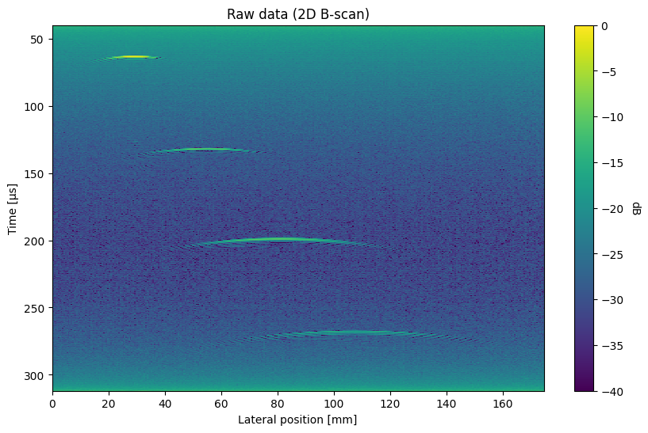
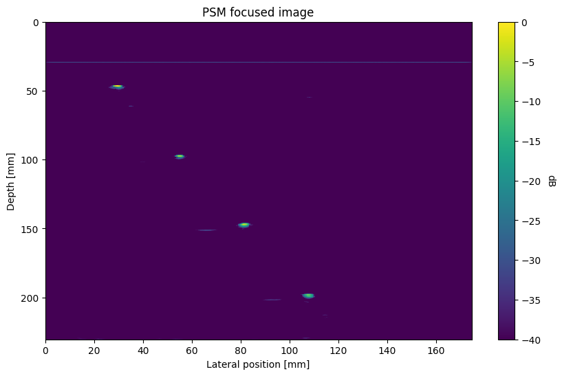

## Synaptus
Synaptus is a Python and Matlab/Octave toolbox for synthetic aperture and array imaging.
It was originally developed for ultrasonic imaging for non-destructive testing, but can
be applied for similar imaging modes (e.g. ground penetrating radar). The toolbox
focuses on algorithms implemented in the Fourier domain, and on imaging in multilayered
structures (e.g. water, metal, rock).

The core functionality of the toolbox is to create focused images from raw (unfocused)
pulse-echo data. Such data is produced by a transducer that transmits waves into a
propagating medium, and records backscattered waves from within the medium. A
backscattered "echo" is created when the waves interact with an object or layer with
different physical properties than the propagating medium, e.g. a metal object in water.
A measurement at a single point in space thus produces a 1-dimensional "depth profile".
By moving the transducer laterally relative to the object under study, it is possible to
create a 2- or 3-dimensional image of the object. Due to the divergence of the
transducer beams, the echoes from scattering objects are "smeared" laterally, making the
images unfocused and hard to interpret (see example in "quick start" below). 

The algorithms in the Synaptus toolbox take such raw, unfocused images as input and
processes them to create focused images. Conceptually, this is done by treating the raw
images as measurements of a wave field, and using the wave equation to manipulate the
wave field into a focused image. The details of this process is described in the PhD
thesis included in the toolbox.

## Quick start
The example code below assumes that the synaptus Python package has been installed. It
follows the `demo_psm_2d.ipynb` notebook found under `python/examples`. 

Import dependencies, the PhaseShiftMigration class, and utility functions for loading
datasets and plotting 2D ultrasound images:

``` { .python}
from pprint import pprint

import numpy as np
from scipy.signal import hilbert

from synaptus import (
    PhaseShiftMigration,
    load_mat_dataset,
    plot_us_image,
)
```

Load an example dataset (included with synaptus):
``` { .python}
# Load dataset
mat_dataset = load_mat_dataset("LineScan2D_WireTargets.mat")
pprint(mat_dataset)
```

The following dataset properties are printed: 
 
``` { .text .no-copy}
UltrasoundDataset(raw_data=array([[ 9.97680625, 11.89522917, 10.30557292, ..., 10.86622708,
        10.70336667, 11.66129167],
       [11.13305625, 10.02022917, 10.93057292, ..., 11.69435208,
        10.93774167,  9.89566667],
       [11.11743125, 11.12960417, 11.63369792, ..., 10.67872708,
        10.92211667, 11.28629167],
       ...,
       [-2.92944375, -4.69852083, -3.56942708, ..., -3.54002292,
        -3.56225833, -4.10433333],
       [-3.77319375, -3.30789583, -1.94442708, ..., -2.88377292,
        -3.26538333, -3.91683333],
       [-5.00756875, -4.01102083, -4.55380208, ..., -4.57127292,
        -3.12475833, -3.40120833]], shape=(6800, 350)),
                  fs=25000000.0,
                  x_step=0.0005,
                  y_step=None,
                  t_delay=4e-05,
                  f_low=0,
                  f_high=inf,
                  wave_vel=(np.float64(1480.0),),
                  layer_thick=(inf,))
```

The dataset consists of 350 ultrasound measurements ("A-scans"), each 6800 samples long.
The time sampling rate is 25 MHz and the spatial sampling ("step size") is 0.5 mm. A
measurement delay of 40 microseconds was applied from pulse transmission to start of
recording. The data corresponds to a single water layer with wave velocity 1480 m/s, and
unspecified thickness (not relevant for single layers). 

Create a PhaseShiftMigration object, using some of the properties from the dataset, but
overriding the f_low and f_high parameters (lower and upper edges of transducer
passband). Initialization includes transforming the raw data to the Fourier domain.

``` { .python}
# Create PSM object
psm = PhaseShiftMigration(
    raw_data=mat_dataset.raw_data,
    fs=mat_dataset.fs,
    f_low=0.4e6,
    f_high=2.5e6,
    x_step=mat_dataset.x_step,  # type:ignore
    t_delay=mat_dataset.t_delay,
    wave_velocities=mat_dataset.wave_vel,
)
``` 

Display the raw data amplitude (calculated using Hilbert transform), using the
`plot_us_image` utility function. The image scene contains 4 point scatterers (steel
wires) that have been laterally "smeared" into hyperbolas. 

``` { .python}
# Display raw data
plot_us_image(
    np.abs(hilbert(psm.raw_data, axis=0)),
    x_val=psm.x_vec * 1e3,
    y_val=psm.time_vec * 1e6,
    title="Raw data (2D B-scan)",
    x_label="Lateral position [mm]",
    y_label="Time [µs]",
    min_db=-40,
    figsize=(10, 6),
)
``` 



Then focus the data using phase shift migration:

``` { .python}
# Run migration (focus image)
images, z_vecs = psm.phase_shift_migrate()
``` 

... and plot the focused image, using the same utility function as above. Note the
change of vertical coordinates from time to depth (mm).

``` { .python}
# Plot focused image
plot_us_image(
    images[0],
    x_val=psm.x_vec * 1e3,
    y_val=z_vecs[0] * 1e3,
    min_db=-40,
    figsize=(10, 6),
    title="PSM focused image",
    x_label="Lateral position [mm]",
    y_label="Depth [mm]",
)
```


